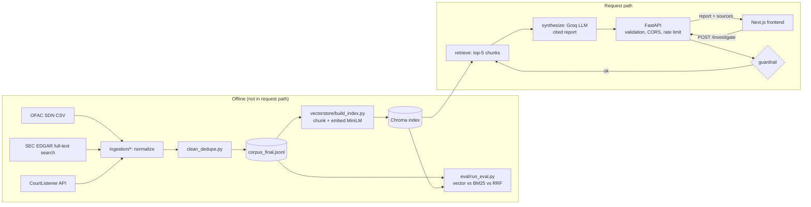

# Agentic OSINT Analyst

A retrieval-grounded research agent that investigates a **category** of entity (for example,
"money services business with prior consent order for AML violations") using public records from
OFAC, SEC EDGAR and CourtListener. It retrieves matching excerpts, asks an LLM to write a report in
which every claim cites an excerpt number, and returns the excerpts alongside the report so a reader
can check the work.

It is a small, single-purpose project: one two-node LangGraph pipeline, a local vector index, a
FastAPI service, a retrieval evaluation harness, and a minimal Next.js front end.

> **Status:** a working prototype with a measured but modest retrieval evaluation (n = 17) and known
> limitations, listed below. It is not a production compliance tool.

## The problem

Open-source entity research means searching several public sources that each have different quirks
(OFAC's search matches names only, EDGAR full-text search is noisy unless quoted, court opinions are
long). The project asks: can retrieval over a small unified corpus plus a grounded synthesis step give
an analyst a cited starting point quickly, and how would you know whether retrieval is any good?

Scope guardrail: it investigates entity categories and public organisational records, not named
individuals. OFAC records of type "individual" are dropped at ingestion, the agent refuses queries
that look like attempts to identify a person, and the synthesis prompt tells the model not to name
private individuals. See [Limitations](#limitations) for how far that goes.

## Architecture



| Piece | Where | What it does |
|---|---|---|
| Ingestion | `ingestion/` | Fetch and normalise OFAC SDN, SEC EDGAR filings and CourtListener opinions into one schema; `clean_dedupe.py` strips HTML/boilerplate/noise and tags near-duplicates. |
| Index | `vectorstore/build_index.py` | Chunks long documents (500 characters, 50 overlap), embeds with `all-MiniLM-L6-v2`, writes ChromaDB. Idempotent. |
| Agent | `agent/graph.py` | LangGraph `retrieve -> synthesize`. Parses `[n]` citations from the report; returns cited documents and all retrieved excerpts. |
| API | `api/main.py` | `POST /investigate`, `GET /examples`, `/health`, `/ready`. Input validation, CORS allow-list, per-IP rate limit, safe error mapping. |
| Evaluation | `eval/` | Recall@10 for vector, BM25 and RRF hybrid on a 17-query golden set. |
| Front end | `frontend/` | Example queries, loading and error states, report plus source evidence. |
| Demo assets | `demo/` | A 24-document public-record sample corpus and four prerecorded real agent responses. |

## Quick start

Developed and tested on Python 3.13 (other versions untested) and, for the front end, Node 25 (older versions untested; Next.js 16 documents its own minimum).

```bash
python3 -m venv .venv && source .venv/bin/activate
pip install -r requirements-dev.txt
cp .env.example .env          # then edit; .env is git-ignored
pytest                        # 71 tests, no network, no API key
```

The first command that loads the embedding model downloads about 90 MB from Hugging Face.

### Environment variables

Read in [`config.py`](config.py); documented with placeholders in [`.env.example`](.env.example).

| Variable | Needed for | Default |
|---|---|---|
| `GROQ_API_KEY` | live investigations (LLM call) | none |
| `CONTACT_USER_AGENT` | ingestion (SEC/OFAC reject anonymous clients) | none |
| `COURTLISTENER_API_TOKEN` | ingestion, optional | none |
| `CHROMA_PERSIST_DIR`, `DATA_DIR`, `CORPUS_PATH`, `CHROMA_COLLECTION` | storage locations | repo-relative |
| `TRACE_DIR` | per-request trace JSON (empty disables) | `logs/traces` |
| `LLM_MODEL`, `EMBEDDING_MODEL`, `TOP_K`, `LLM_TIMEOUT_SECONDS` | model tuning | see `config.py` |
| `CORS_ALLOWED_ORIGINS` | API; explicit origins only, `*` is refused | `localhost:3000` |
| `RATE_LIMIT_PER_MINUTE`, `TRUST_PROXY_HEADERS` | API | `10`, `false` |
| `DEMO_MODE` | `off` or `prerecorded` | `off` |

## Try the demo (no API key, no cost)

The demo uses assets committed in `demo/`, all derived from public records with the source URL kept on
every document and excerpt.

**1. Prerecorded API + front end.** The four example queries replay real reports that the agent
generated on 2026-09-18. Every such response is labelled `"mode": "prerecorded"` with a notice, and the
front end shows a banner.

```bash
DEMO_MODE=prerecorded uvicorn api.main:app --port 8000
```

```bash
cd frontend && cp .env.example .env.local && npm install && npm run dev
```

If port 3000 is taken, Next.js picks another port; add that origin to `CORS_ALLOWED_ORIGINS`.

**2. Build a real index from the public sample and run the evaluation harness on it.** This uses the real
embedding model and Chroma, and costs nothing beyond the model download.

```bash
python -m vectorstore.build_index --corpus demo/sample_corpus.jsonl --persist-dir /tmp/osint-demo-chroma
python -m eval.run_eval --corpus demo/sample_corpus.jsonl --golden demo/golden_set.json \
  --persist-dir /tmp/osint-demo-chroma --out /tmp/demo_eval.json
```

This corpus has 24 documents, so a top-10 list covers a large share of it. Treat the result as a
smoke test of the harness, not as a retrieval benchmark.

**3. Live mode on the sample** (calls the Groq API with your key; cost is yours):

```bash
CHROMA_PERSIST_DIR=/tmp/osint-demo-chroma uvicorn api.main:app --port 8000
curl -s localhost:8000/investigate -H 'content-type: application/json' \
  -d '{"entity_cluster_id": "tug boat linked to Petroleos de Venezuela state oil company"}'
```

## Full pipeline

These steps make live network calls to public sources and take time; they are not needed for the demo.
The full corpus is generated data and is git-ignored.

```bash
# Ingestion (writes data/processed/*_normalized.jsonl). Needs CONTACT_USER_AGENT in .env.
python -m ingestion.ofac_sdn
python -m ingestion.sec_edgar
python -m ingestion.courtlistener
python -m ingestion.clean_dedupe          # writes data/processed/corpus_final.jsonl

# Index (embeds every chunk locally; roughly 8,000 chunks for the author's corpus)
python -m vectorstore.build_index

# One investigation from the command line (needs GROQ_API_KEY)
python -m agent.graph "cryptocurrency exchange with prior AML compliance actions"

# Serve
uvicorn api.main:app --port 8000
```

Ingestion reads the live OFAC list and the SEC/CourtListener search APIs, so a re-run returns different
data than the author's 2026-09 snapshot. Re-running was not part of this review.

## API

```bash
curl -s localhost:8000/investigate -H 'content-type: application/json' \
  -d '{"entity_cluster_id": "money services business with prior consent order for AML violations"}'
```

`entity_cluster_id` is a free-text entity-category profile, 10-300 characters (the field name is kept
from the original API; no external clustering system supplies IDs).

```jsonc
{
  "entity_cluster_id": "...",
  "report": "markdown text citing excerpts as [1], [2] ...",
  "citations": ["sec-edgar-..."],        // documents the report actually cites
  "sources": [                           // every retrieved excerpt
    {"index": 1, "doc_id": "...", "source": "SEC_EDGAR", "title": "...",
     "url": "https://www.sec.gov/Archives/...", "excerpt": "...", "cited": true}
  ],
  "token_usage": {"input_tokens": 1016, "output_tokens": 1484, "latency_seconds": 3.6},
  "mode": "live",                        // or "prerecorded"
  "notice": null
}
```

`citations` and `cited` come from parsing the model's `[n]` markers; an excerpt that was retrieved but
not cited has `cited: false`. This shows which excerpts the report points at; it does not prove each
claim is actually supported by the excerpt it cites (see Limitations).

| Status | Meaning |
|---|---|
| 200 | Report returned |
| 400 | Guardrail: request looks like an attempt to identify a person |
| 404 | Prerecorded mode only: query is not one of the examples |
| 422 | Invalid body (length, control characters, unknown fields) |
| 429 | Rate limit; `Retry-After` header set |
| 502 / 503 | LLM provider failure / missing LLM key or index (details logged server-side only) |

Other endpoints: `GET /examples`, `GET /health` (liveness), `GET /ready` (index present, LLM key
configured; never returns secrets). Interactive docs at `/docs`.

## Evaluation

Measured on 2026-10-01 against the preserved 2026-09 snapshot (2,339 documents, 8,036 vectors); these
reproduced the original numbers exactly. Full write-up: [`eval/STAGE_5_RESULTS.md`](eval/STAGE_5_RESULTS.md).

| Method | Mean recall@10 (n = 17) |
|---|---|
| Vector (MiniLM + Chroma) | 0.471 |
| BM25 | 0.412 |
| RRF hybrid | 0.529 |

What to take from it, and what not to:

- **Hybrid never beat the better single method on any query** (0 wins, 17 ties, 0 losses). Its higher mean
  than vector alone comes from BM25 winning on a few queries.
- **OFAC recall is about 0.14 for vector and 0 for BM25, but that mostly reflects the labels, not just retrieval.**
  Each query labels one document while dozens of records are equally relevant (64 OFAC records link to
  the same shipping company). A lenient diagnostic shows the vector top-10 satisfies the query's
  attribute rule 67% of the time on those queries. Some misses are real (for example, "Venezuelan
  aeronautics industry" versus a Spanish-language entity name).
- 17 queries is small; one or two queries move the mean. The golden set was written from known documents,
  and the lenient rules were added after the results were seen.
- The OFAC/cleaning bug described in the eval write-up was fixed after these numbers were produced and
  the pipeline was **not** re-run, so the table reflects the pre-fix corpus.
- Exact reproduction needs the 2026-09 snapshot (`corpus_sha256` is recorded in `eval/eval_results.json`).

Not measured: answer groundedness (whether claims match their cited excerpts), report quality, and
end-to-end latency including retrieval. The only latency data is the LLM call: mean 3.57 s over 5
recorded runs (`python -m eval.cost_report`; n is tiny). [`STAGE_8_TIMING.md`](STAGE_8_TIMING.md) records
an informal N=1 manual-versus-agent timing; it is an anecdote, not a benchmark.

## Tests

```bash
pytest                 # fast: 71 tests, fakes for the retriever and LLM, no network or API key
pytest -m slow         # builds a real index from demo/sample_corpus.jsonl with the real embedding model
```

Covered: guardrail, citation parsing, graph behaviour with fake retriever and LLM, error mapping, API
validation / CORS / rate limiting / prerecorded mode, chunking, idempotent index build, retrieval metrics,
OFAC normalisation (individuals excluded, placeholders cleaned), the cleaning regression, and integrity
checks on the committed demo assets. Not covered: live calls to OFAC, SEC, CourtListener or Groq, and the
front end (it is type-checked and built, and was exercised manually in a browser).

## Deployment

See [`docs/DEPLOYMENT.md`](docs/DEPLOYMENT.md) for readiness (including a no-Docker prerecorded backend using `requirements-demo.txt`), the Docker image, storage and database
provisioning, and remaining blockers. Short version: front end on Vercel, Python backend hosted
separately; the index is built offline and provisioned to the backend, never built inside a request.

## Limitations

- **Guardrail is a keyword filter**, easy to rephrase around, and blocks some harmless questions
  ("who is..."). It reduces misuse; it does not guarantee that no person is identified.
- **The corpus is not individual-free.** OFAC individuals are dropped, but SEC filings and court opinions
  can name people (case captions, officers, signatories). The prompt asks the model not to name private
  individuals; this is not verified or enforced.
- **Citation checking is structural.** A `[n]` marker links a claim to an excerpt; nothing verifies the
  excerpt supports the claim. For example, one recorded report says the excerpts "indicate" that entities "are aware of" sanctions risk, which is an inference from compliance-program language.
- **Small, partial corpus** (a few hundred SEC/court documents from four SEC and four court queries). Reports
  can miss relevant documents; the manual trial found two that retrieval missed.
- Top-5 chunks can come from the same document; there is no reranking or query rewriting.
- Evaluation is small and its relevance labels are incomplete (see above).
- The LLM is an external Groq-hosted model: output varies by model version, and requests send retrieved
  public excerpts and the query to a third party.
- The rate limiter is in-memory and per-process; there is no authentication.
- Near-duplicate documents are tagged but still indexed.

## Data sources and attribution

All data are public records, fetched from the sources' own public endpoints. Each document keeps its
source URL.

- **OFAC SDN list** - U.S. Treasury Office of Foreign Assets Control, `sanctionslistservice.ofac.treas.gov`.
- **SEC EDGAR** - U.S. Securities and Exchange Commission, full-text search and filing documents.
- **CourtListener** - Free Law Project (`courtlistener.com`) search API for published opinions.

`demo/sample_corpus.jsonl` contains truncated excerpts of 24 such documents; `demo/prerecorded_responses.json`
contains LLM output generated from them. Check each provider's terms of use before redistributing data or
using the APIs at scale; follow SEC fair-access guidance (declared contact in the User-Agent, request
rate limits) when ingesting.

## Repository layout

```
agent/        LangGraph agent (retrieve -> synthesize), guardrail, citation parsing
api/          FastAPI app
config.py     all environment-driven settings
demo/         sample corpus, demo golden set, prerecorded responses, asset builder
docs/         case study, deployment notes
eval/         golden set, run_eval.py, bm25_baseline.py, cost_report.py, results
frontend/     Next.js app
ingestion/    OFAC / SEC / CourtListener ingestion + cleaning
tests/        pytest suite
vectorstore/  index builder, corpus loader
Dockerfile    backend image
```
