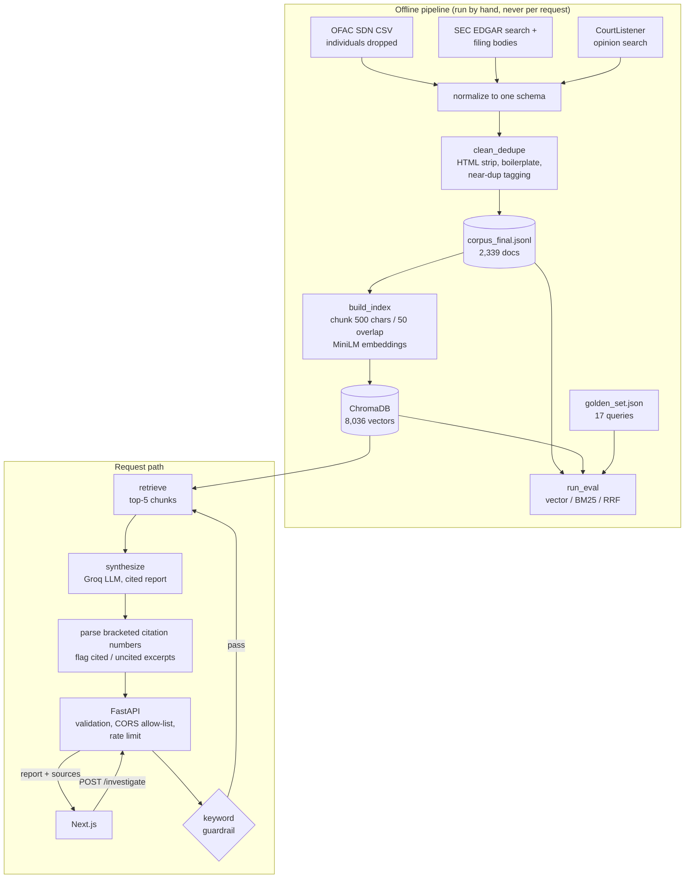

# Case study: Agentic OSINT Analyst

**A retrieval-grounded research agent over public records, with an evaluation I tried to keep honest.**

Stack: Python, LangGraph, ChromaDB, sentence-transformers (MiniLM), Groq-hosted LLM, FastAPI, Next.js.
Repo: <https://github.com/gaurannggg7/osint-synthesis-engine>

## Summary

Given a description of an entity category ("money services business with prior consent order for AML
violations"), the system retrieves excerpts from a corpus of OFAC sanctions entries, SEC EDGAR filings
and CourtListener opinions, asks an LLM for a report where each claim cites an excerpt, and returns the
report together with the excerpts. A separate evaluation harness compares vector, BM25 and hybrid
retrieval. It is a prototype, built to learn how retrieval quality and grounding behave on messy real
documents, not to ship as a product.

## Problem

Public-record research spans sources with different shapes: terse structured sanctions rows, long
filings, court opinions. Searching each by hand is slow and the tools differ (OFAC's search matches names
only; EDGAR full-text search needs quoted phrases to be usable). The questions I wanted to answer:

1. Can one unified, chunked index plus a grounded synthesis step produce a *checkable* starting point?
2. How do I find out whether retrieval is any good, and where it fails?

## Architecture as implemented

The agent is a two-node LangGraph (`retrieve -> synthesize`). That is deliberate: there is no
planning loop or tool use here because nothing in the task needed one.

## Technical decisions

- **Ingestion-time guardrail for OFAC.** Individuals are dropped before anything is indexed, so retrieval
  cannot surface them, rather than relying on the model to refuse. The request-time check is a keyword
  filter and is documented as weak. SEC and court text can still contain names; that is a known gap.
- **Chunking by source type.** Short OFAC records are embedded whole; long filings are split. Each chunk
  keeps `doc_id`, source and URL so every hit traces back to an original document.
- **Chunks versus documents in evaluation.** Vector search returns chunks, so the evaluation deduplicates
  to parent documents before computing recall; otherwise "top 10" could mean three documents.
- **RRF instead of score averaging** for hybrid, because cosine distance and BM25 scores are not on a
  common scale.
- **Citations as structure, not trust.** The report is parsed for `[n]` markers; the API returns every
  retrieved excerpt flagged `cited` or not. A reader sees what the answer rests on. Out-of-range markers
  are ignored. This does not verify that a cited excerpt supports its claim, and the docs say so.
- **Injectable retriever and LLM** (`build_graph(retriever=..., llm=...)`), so the agent, API error
  mapping and rate limiter are tested with fakes: no key, network or model download in the main test run.
- **Index built offline, idempotently** (deterministic chunk IDs, collection rebuilt). Found during review:
  the original builder appended duplicate vectors on every re-run.
- **Fail fast with actionable errors.** A missing index no longer silently creates an empty Chroma DB and
  returns "no documents"; a missing API key fails before the slow retrieval step. The client gets a safe
  message; the operator's log gets the fix.
- **Prerecorded demo, clearly labelled.** For a public deployment with no LLM spend, the API can replay four
  real saved runs. Every replay carries `mode: "prerecorded"` and a notice, and the retrieval for each was
  re-run and compared to the original trace before pairing it with its report.

## Verified results

All measured by me; numbers are in `eval/eval_results.json` or reproducible with the commands in the README.

| What | Result |
|---|---|
| Test suite | 71 fast tests pass offline; 1 slow test (real embedding model, real Chroma, idempotent rebuild) passes |
| Clean install | Pinned `requirements-dev.txt` installs in a fresh Python 3.13 venv |
| Retrieval recall@10 (n = 17, 2026-09 snapshot) | vector 0.471, BM25 0.412, RRF hybrid 0.529; reproduced exactly on re-run |
| Hybrid vs. best single method | 0 wins, 17 ties, 0 losses |
| OFAC-style queries, strict recall@10 | vector 0.143, BM25 0.000 |
| OFAC-style queries, lenient attribute precision@10 (n = 6) | vector 0.667, BM25 0.450, hybrid 0.550 |
| LLM-call latency | mean 3.57 s over 5 recorded runs (LLM call only; excludes retrieval) |

### What the evaluation taught me

The headline said hybrid beats both methods. The per-query comparison shows it never beats the better of
the two. The OFAC recall of nearly zero looked like a retrieval failure and had a tidy explanation in the
original notes (short documents). Testing it showed the explanation was unsupported: each OFAC query labels
one document while 40 to 120 records are equally valid answers, so strict recall measures luck as much as
quality. A lenient diagnostic shows the vector top-10 mostly satisfies the query's constraint. Real misses
remain (vocabulary gaps such as "Venezuelan aeronautics industry" versus a Spanish entity name).

I also found, while tracing the OFAC data, that the boilerplate stripper had deleted the `Type: vessel`
line from 1,540 of 1,882 OFAC records. It is fixed and tested, and I checked it did not explain the
recall gap. I did not re-run the full pipeline afterward, so the published numbers predate the fix.

## Limitations

- Small evaluation: 17 queries written from known documents; incomplete relevance labels; lenient rules
  written after seeing results.
- Corpus is a small partial snapshot (382 SEC filings, 75 court opinions, 1,882 OFAC records). The manual
  trial found relevant documents the agent missed.
- No answer-quality or groundedness evaluation; citation parsing is structural.
- Guardrail is keyword-based; the corpus can contain names of individuals.
- The timing comparison with manual research is a single informal trial (N=1) and says nothing about quality.
- External LLM dependency; rate limiter is per-process; no authentication.
- Full-corpus numbers are reproducible only with the 2026-09 snapshot, which is not in the repository.

## Next steps

1. Re-run clean, index and evaluation after the OFAC fix and report the difference.
2. Add attribute-based relevance labels and more queries; add a held-out set.
3. Evaluate groundedness: have a judge (model or human) check whether each claim is supported by its cited
   excerpt, on a labelled sample.
4. Try OFAC records rewritten as sentences before embedding, and a vocabulary-bridging step (query expansion).
5. Rerank and deduplicate by document before synthesis so five excerpts are not three chunks of one filing.

## Suggested demo interaction: compare retrieval methods on your query

**What a visitor does.** Type or pick an entity-category query and see three ranked lists side by side:
vector, BM25 and hybrid (top 10 each), with documents that appear in only one list highlighted and each
result linking to its source. A short note explains why strict recall can understate retrieval on
group-style queries. This makes the project's most interesting finding explorable, and it needs no LLM, so
it is fast, free to host and safe to leave open.

**What it needs (none of this exists yet):**

1. A `POST /search` endpoint (about 50 lines) that reuses `vector_top_k`, `bm25_top_k` and `rrf_hybrid` from
   `eval/run_eval.py` and returns ranked `doc_id`, title, source, URL and a snippet per method.
2. A corpus loaded into the backend at startup to build the BM25 index (about 4 MB for the full corpus) and
   the Chroma index provisioned alongside it. For a zero-cost first version, use the committed 24-document
   sample, with a visible label that it is a sample.
3. A results component in the front end: three columns, overlap highlighting, loading and error states
   (the existing ones carry over).
4. Tests for the endpoint (validation, rate limit, response shape) in the same style as `tests/test_api.py`.
5. A decision on which corpus to expose publicly: check each source's terms and avoid presenting a
   partial snapshot as comprehensive.
